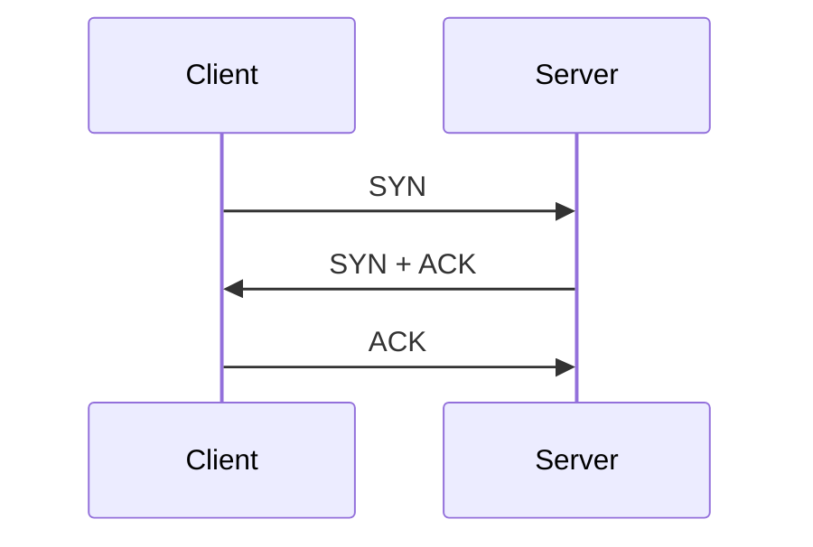
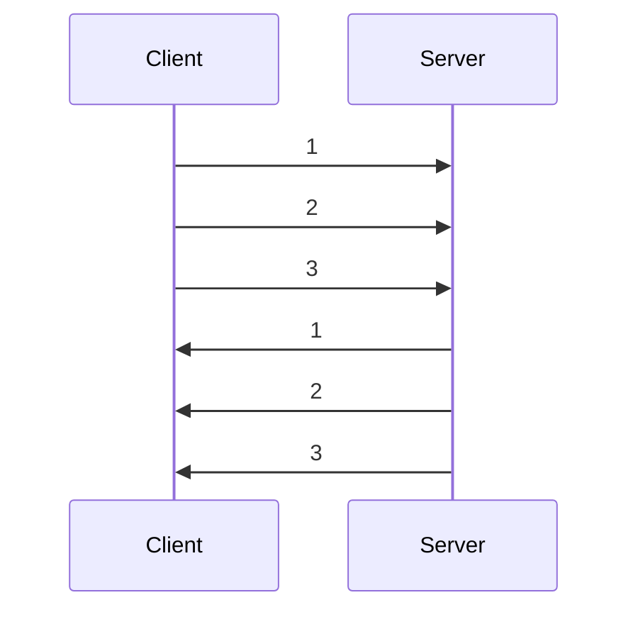

# 인터넷 네트워크

- IP(Internet Protocol) : 인터넷 프로토콜
- TCP(Transmission Control Protocol) : 전송 제어 프로토콜
- UDP(User Datagram Protocol) : 사용자 데이터그램 프로토콜
- PORT : 컴퓨터 내에서 프로세스를 식별하는 번호
- DNS(Domain Name System) : 도메인 네임 시스템

## IP(Internet Protocol)

IP은 인터넷에서 컴퓨터 간에 데이터를 주고 받기 위한 통신 규약이다.

IP는 패킷이라는 통신 단위로 데이터를 전송한다.

패킷은 헤더와 데이터로 구성되어 있다.

헤더에는 출발지 IP 주소, 목적지 IP 주소, 기타 통신에 필요한 정보가 들어있다.

IP 주소는 32비트로 구성되어 있으며, 8비트씩 4개의 옥텟으로 나누어 표기한다.

### IP 한계

- 비연결성 : 패킷을 받을 대상이 없거나 서비스 불능 상태여도 패킷을 전송한다.
- 비신뢰성 : 중간에 패킷이 사라지거나 순서대로 도착하지 않을 수 있다.
- 프로그램 구분 : 같은 IP를 사용하는 서버에서 통신하는 애플리케이션이 둘 이상일 경우 구분할 수 없다.

## TCP(Transmission Control Protocol)

TCP는 IP 프로토콜 위에서 동작하는 프로토콜이다.

TCP는 출발지 PORT와 목적지 PORT를 사용하여 프로세스를 구분한다.

또한 TCP는 패킷을 재조립하고, 패킷이 순서대로 도착하는지 확인한다.

### TCP 특징

- 연결지향 : TCP 3-way handshake를 통해 연결을 설정하고, 4-way handshake를 통해 연결을 해제한다.
- 신뢰성 : 데이터를 순서대로 전송하고, 패킷이 유실되면 재전송한다.
- 순서 보장 : 패킷의 순서가 바뀌어도 재조립하여 순서대로 전달한다.
- 혼잡 제어 : 패킷이 너무 많이 전송되면 패킷을 조금씩 전송하여 네트워크를 과부하로 만들지 않는다.
- 흐름 제어 : 수신자가 처리할 수 있는 데이터의 양을 넘어서는 데이터를 전송하지 않는다.

#### TCP 3-way handshake

1. 클라이언트가 서버에게 연결 요청을 보낸다.
2. 서버가 클라이언트에게 연결 요청을 수락한다.
3. 클라이언트가 서버에게 연결 요청을 수락했다는 응답을 보낸다.

#### 순서 보장

1. 클라이언트가 서버에게 1, 2, 3 순서대로 데이터를 전송한다.
2. 서버가 클라이언트에게 1, 2, 3 순서대로 데이터를 전송한다.

만약 1, 3, 2 순서로 데이터를 전송한다면, 서버는 1, 2, 3 순서로 데이터를 전송한다.

## UDP(User Datagram Protocol)

UDP는 IP 프로토콜 위에서 동작하는 프로토콜이다.

UDP는 TCP와 달리 연결 설정이나 연결 해제 과정이 없다.

또한 UDP는 데이터를 전송하기 전에 패킷을 재조립하거나 순서를 확인하지 않는다.

HTTP 3.0에서는 UDP를 사용하여 HTTP를 전송하는 QUIC 프로토콜이 등장했다.

## PORT

PORT는 컴퓨터 내에서 프로세스를 식별하는 번호이다.

PORT는 0 ~ 65535까지 사용할 수 있으며, 0 ~ 1023까지는 잘 알려진 포트로 사용한다.

- 22 : SSH
- 23 : TELNET
- 80 : HTTP
- 443 : HTTPS

## DNS(Domain Name System)

DNS는 도메인 네임 시스템으로, 도메인 이름을 IP 주소로 변환하는 시스템이다.

DNS는 도메인 이름을 계층적으로 관리한다.

- 최상위 도메인 : .com, .net, .org, .kr, .jp 등
- 2차 도메인 : naver, google, daum 등
- 3차 도메인 : www, mail, blog 등

IP 주소는 기억하기 어렵고, 변경될 수 있기 때문에 도메인 이름을 사용한다.
