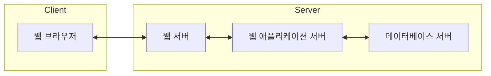

# 웹 서버와 웹 애플리케이션 서버

## 웹 서버

웹 서버(`web server`)란 웹 브라우저로부터 HTTP 요청을 받아 정적인 컨텐츠(`static content`)를 제공하는 컴퓨터 프로그램이다. 웹 서버는 웹 브라우저가 요청한 파일을 찾아서 HTTP 응답으로 만들어서 전송한다.

- 정적인 컨텐츠: 이미지, HTML, CSS, JS 파일 등
- Nginx, Apache 등

## 웹 애플리케이션 서버

웹 애플리케이션 서버(`web application server`)는 요청을 받았을 때 동적으로 결과를 만들어서 전송하는 프로그램이다. 웹 애플리케이션 서버는 웹 서버와 달리 프로그램을 실행시켜서 결과를 만들어서 전송한다. 따라서 사용자의 요청마다 결과가 달라질 수 있다.

- 동적인 컨텐츠: JSP, PHP, ASP, Servlet 등
- Tomcat, Jetty, Netty 등

## 일반적인 서버 구성

일반적으로 웹 서버와 웹 애플리케이션 서버를 분리해서 구성한다. 웹 서버는 정적인 컨텐츠를 처리하고, 웹 애플리케이션 서버는 동적인 컨텐츠를 처리한다. 웹 서버와 웹 애플리케이션 서버를 분리하는 이유는 다음과 같다.

- 정적인 컨텐츠와 동적인 컨텐츠를 분리해서 서버 부하를 줄일 수 있다.
- 웹 애플리케이션 서버에 장애가 발생하더라도 웹 서버는 정적인 컨텐츠 및 에러 페이지를 제공할 수 있다.
- 웹 애플리케이션 서버를 여러 대 두고 로드 밸런싱(`load balancing`)을 할 수 있다.

즉, 웹 서버는 정적인 컨텐츠를 처리하고, 웹 애플리케이션 서버는 동적인 컨텐츠를 처리한다. 웹 서버와 웹 애플리케이션 서버를 분리해서 구성하면 서버 부하를 분산시킬 수 있고, 장애 대응이 가능하다.
